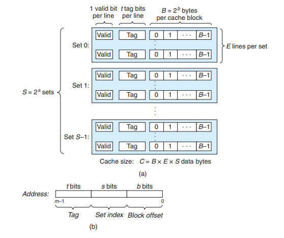

# PartA

****

## 任务目标

* 在 csim.c 中编写一个缓存模拟器，该模拟器接受trace文件中的模拟内存操作作为输入，模拟该跟踪上缓存内存的命中/错过行为，并输出命中、错过和驱逐的总数。

* 模拟器应该接受以下命令行参数-s \<s>  -E \<E>  -b \<b>  -t \<tracefile>，分别表示索引位数，每组行数，块位数，要使用的跟踪文件的名称。在每组行数E>1时，程序应该适用LRU(least-recently used)来替换缓存行。实验文档提示可以用getopt来解决命令行参数读取和分割。需要包含以下头文件
  
  > #include \<getopt.h>
  > #include \<stdlib.h>
  > #include \<unnistd.h>

* 内存trace的形式如下
  
  > I 0400d7d4,8
  >  M 0421c7f0,4
  >  L 04f6b868,8
  >  S 7ff0005c8,8
  
  *  格式为[操作] 内存地址 操作访问的数据大小。I表示指令加载，L表示数据加载，S表示数据储存，M表示数据修改（先加载后原位储存）。除了I指令外操作前都有空格。
  
  * 根据实验文档，对于这个实验，应该假设内存访问是正确对齐的，这样一个单一的内存访问永远不会跨越块边界。通过这个假设，你忽略请求大小。并且对于高速缓存来说，数据加载和数据储存在计算计算命中驱逐时没有区别，所以L，S指令简化为1一种操作，M简化为同一种操作两次。

***

## 具体实现

****

### 1. 读取命令行参数

使用getopt函数读取。函数原型如下

```c
int getopt(int argc, char * const argv[], const char *optstring);

extern char *optarg;
extern int optind, opterr, optopt;
```

argc和argv[]是从main函数传入的参数，分别表示参数数量和参数的字符数组(简单来说保存了打的整条命令)。optstring是一个包含正确的参数选项字符串用于参数解析。"extern"所引的外部变量oprarg为用来保存选项的参数为字符串（如果有），optind为argv[]数组当前检索位置（即指向下一个元素），opterr是否将错误信息输出，为0时表示不输出(即正常情况)，optopt不在选项字符串optstring中的选项。getopt函数调用时会返回命令行传入的参数，没有参数时返回-1。

举例说明，optstring用来表示命令行选项是否应该有参数，有参数要在选项字符串对应选项后加“：”。比如本题中需要的选项字符串为“sEbt:hv”，因为前4个需要接受参数，h和v不需要。函数作用是为sEbt这几个用到的变量赋值，并且获取到所需trace文件的指针，提前将s,b,E等声明为全局变量，函数需要接受main函数传来的参数，并且不需要返回值。

由此声明读取参数的函数原型：

```c
void get_opt(int argc, char *argv[]);
```

注意在一般情况下optind指向下一个元素，比如“-s”选项会携带的数字参数，以字符串形式在argv数组中排在“-s”元素的后方，此处索引就是optind值，但在getopt函数在处理“-t”选项时optind值会多1(原因不明)，在测试时读取“s, E, b, t”时的optind分别为“2,4,6,9”。所以想要找到正确的文件名称字符串的索引应该为应该optind-1。代码如下：

```c
int s, E, b , S, B;
FILE *filename；
void get_opt(int argc, char *argv[]);

void get_opt(int argc, char * argv[]){
    int opt;
    while ( (opt=getopt(argc, argv, "sEbt:hv")) != -1 )
//注意！运算符优先级仅低于括号，把前面用括号括起来
    {
        switch (opt)
        {
        case 's':
         //将数字字符转换为int类型
            s = atoi(argv[optind]);
            break;
        case 'E':
            E = atoi(argv[optind]);
            break;
        case 'b':
            b = atoi(argv[optind]);
            break;
        case 't':
         //将文件以只读模式打开，返回的文件指针赋给filename
            filename = fopen(argv[optind-1], "r");
            break;
        default:
            break;
        }
    }
}
```

***

### 2. 读取文件内容和解析地址

通过命令行参数可以获取到所需文件的文件指针，接下来应该对文件中的内容进行处理。我们不需要处理指令缓存访问，所以所有I开头的行都可以忽略，“M”, “L”, and “S”指令的前方都有空格。可以用“fscanf”函数处理每行的数据，对于读取的第一个字符用switch来分情况进行操作，L，S进行一次操作，M进行两次操作。函数直接写在主函数里方便扩展。

对于读取到的内存地址应该储存在至少有64位变量中，储存为“unsigned long”或者用精准宽度类型"__uint64_t"，相当于用typedef定义了一个64位的数据类型。通过位操作和掩码操作获得标记、组索引和偏移量（对于本实验来说偏移量是无用量）。将地址右移b位并和共s位的1（十进制数为2^s-1）进行与运算得到组索引，将地址右移s+b位得到标记值，为了避免超出范围同样用64位储存。函数不需要参数和返回值。

函数原型和定义为

```c
unsigned long addr, t;
int s_index; 
//分解地址得出t和组索引
void div_addr(); 
int main(int argc, char * argv[])
{
    char ope;
    get_opt(argc, argv);
    while ((fscanf(filename, " %c %lx,%zd\n", &ope, &addr, &x)) != EOF)
    {
        switch (ope)
        {
        case 'S':
        case 'L':

            break;
        case 'M':

        default:
            break;
        }
    }
    fclose(filename);

    printSummary(0, 0, 0);
    return 0;
} 
void div_addr(){
    s_index = (addr >> b) & (int)(pow(2, s)-1);
    t = addr >> (b + s);
}
```

****

### 3.模拟缓存的结构和操作



如图是高速缓存的图示，可以看到高速缓存的最小单位是行，每E行可以组成一个组，E=1时每组在替换时是直接替换，>1时首先会填充组的剩余空行，如果满了就会执行一定的替换策略。对于每行存储的信息有有效位，标记位和实际数据块。对于这个实验，实际上并不需要真正的数据块，只需要标记位来判断是否命中。所以实际需要的是某数据类型储存标记位作为行，再用某种类型将特定行标记为组。

实验要求实现LRU替换策略，简单来说就是既不常用又来的早的行将要被驱逐，不满足任意一点的行都能保证在此次组充满时不被驱逐。对此我们可以假设一种排队策略，即每次有新元素入列时都将此元素排在队列最前，如果访问的是已经有的元素，就将该元素提到队首，这样可以保证最新的元素和最常用的元素不被驱逐，依照此策略，队列最后的元素就是应该驱逐的元素。所以以此策略作为LRU的实现策略。c语言里数组并不适合对数据进行排序和插入，可以考虑方便插入和改变顺序的链表用作储存组的类型。因为在将链表中间节点提到队首的时候同时需要将前后两节点连接起来，可以在每个节点中保存前一个节点的地址，组成双向链表。

决定了用链表作为每组的储存方式，为了便于得到每一节点的地址，可以用malloc函数分配节点的内存空间，返回指向内存空间的指针（要注意返回的指针为void类型通用指针，应该用强制类型转换为结构指针）。链表应该维持一个表头，保存着头尾节点的地址和链表节点数量（也就是代表着组中有效行的数量），这个表头可以代表高速缓存中的每一组。可以用数组保存这些表头，这样可以用数组的索引来访问每一组。判断某内存地址的数据是否存储在高速缓存中的基本流程为：先分解出组索引和标记，然后根据组索引访问数组中的某一特定组的表头，再遍历链表判断标记数据是否是某一节点。先定义节点和表头的结构。

```c
typedef struct _Node
{
    struct _Node* pre;
    unsigned long value;
    struct _Node* next;
} Node; 
 typedef struct Double_list
 {
    Node* head;
    Node* tail;
    int size;
 } List;
```

现在开始考虑所需函数的原型和操作。~~创建组的函数需要提供S的大小，返回数组名。~~（因为忘了变长数组不能为静态储存类别，所以创造数组放在主函数里，为了避免数组过大，同样用malloc分配空间）判断块是否在组里的函数需要提供标记值和该组表头，返回所在节点的指针或空指针。将在链表内的节点提到头节点需要提供节点指针和表头，不需要返回值。添加节点到链表需要节点指针和表头，不需要返回值。删除尾节点需要提供表头，不需要返回。释放空间需要提供组数组名，不需要返回。

```c
//判断某内存块是否在组中
Node* is_in_sets(unsigned long t, List* list);
//添加新块到链表头节点
void addto_head(unsigned long t, List* list);
//将原链表中的块提为头节点
void to_head(Node* node, List* list);
//删除尾结点
void del_tail(List* list);
//释放链表分配的空间
void free_list(List*);
```

具体函数实现见csim.c。

然后模拟一下整个流程。当从内存地址中分解出组索引和标记值后，首先判断在该组内是否存在，如果不存在调用addto_haed函数，并且misses值+1，存在就调用to_head函数，并hits+1。完成这次判断后再次判断组是否已满，已满就调用del_tail函数，eviction+1，未满则继续循环。再写一个L_simu函数打包这些操作，不需要返回值，需要提供组表头和标记值。具体如下：

```c
void L_simu(List* list, unsigned long t){
    Node* cur_node = is_in_sets(target, list);
    if (cur_node != NULL)
    {
        hits++;
        to_head(cur_node, list);
    }
    else
    {
        if ((list->size) == E)
        {
            evictions++;
            del_tail(list);
        }
        misses++;
        addto_head(target, list);
    }

}
```

然后在主函数中调用，补齐每写完的部分，如下

```c
       switch (ope)
        {
        case 'S':
        case 'L':
            div_addr();
            L_simu(&sets[s_index], target);
            break;
        case 'M':
            div_addr();
            L_simu(&sets[s_index], target);
            L_simu(&sets[s_index], target);
            break;
        default:
            break;
        }
```

具体代码和注释请参考/cachelab/cachelab-handout/cism.c文件。
